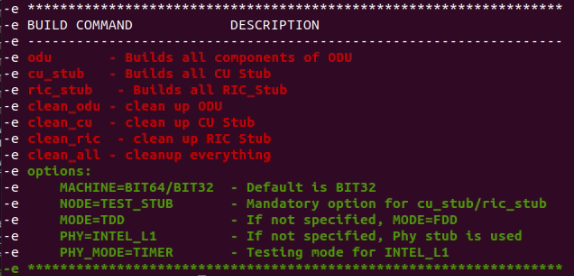

# O-DU

## Preparation before compiling <sup>[1](https://hackmd.io/LZu1Ts19Qw6R_kP_smxRTA?view#Choices)</sup>

Download [G_Rel_l2.tar.gz](./G_Rel_l2.tar.gz.extension).

```bash
cd /home/four/
tar -xzf G_Rel_l2.tar.gz
cd l2/build/odu/
```

#### Edit the `makefile` before building,

```bash
vim makefile
```

- Edit the wls/DPDK library according to your environment, for example:
-       wls library  : -L/opt/cek/intel-flexran/wls_mod
-       DPDK library : -L/opt/cek/dpdk-21.11/build/lib/

```patch
# Add to the linker options the platform specific components
L_OPTS+=-lnsl -lrt -lm -lpthread -lsctp
ifeq ($(PHY), INTEL_L1)
-       L_OPTS+=-L/home/oran/F_l1_G_l2/phy/wls_lib -lwls                         \
+       L_OPTS+=-L/opt/cek/intel-flexran/wls_mod -lwls                           \
-       -lhugetlbfs -lnuma -ldl -L/home/oran/DPDK/dpdk-stable-20.11.3/build/lib/                        \
+       -lhugetlbfs -lnuma -ldl -L/opt/cek/dpdk-21.11/build/lib/                        \
        -lrte_gso -lrte_acl -lrte_hash -lrte_bbdev -lrte_ip_frag -lrte_bitratestats -lrte_ipsec        \
        -lrte_bpf -lrte_jobstats -lrte_telemetry -lrte_kni -lrte_kvargs -lrte_latencystats -lrte_port  \
        -lrte_lpm -lrte_power -lrte_mbuf -lrte_rawdev -lrte_member -lrte_cfgfile -lrte_mempool         \
                  -lrte_cmdline -lrte_rcu -lrte_compressdev -lrte_reorder -lrte_cryptodev -lrte_rib              \
                  -lrte_distributor -lrte_meter  -lrte_ring -lrte_eal -lrte_metrics -lrte_sched -lrte_efd        \
                  -lrte_net -lrte_security -lrte_ethdev -lrte_pci -lrte_stack -lrte_eventdev -lrte_pdump         \
                  -lrte_table -lrte_fib -lrte_pipeline -lrte_timer -lrte_flow_classify -lrte_vhost               \
        -lrte_gro
endif
```

#### Copy wls_lib to O-DU high folder

```bash
cd /home/four/l2/src/
sudo rm -r dpdk_lib/ wls_lib/
mkdir wls_lib/

cp -r /opt/cek/intel-flexran/wls_mod/* /home/four/l2/src/wls_lib/
```

#### Copy necessary DPDK header file to O-DU High folder

```bash
mkdir dpdk_lib/
cd /opt/cek/dpdk-21.11/lib/eal/include/
cp rte_branch_prediction.h rte_common.h rte_dev.h rte_log.h rte_pci_dev_feature_defs.h rte_bus.h rte_compat.h rte_debug.h rte_eal.h rte_per_lcore.h /home/four/l2/src/dpdk_lib/

cp /opt/cek/dpdk-21.11/config/rte_config.h /home/four/l2/src/dpdk_lib/
cp /opt/cek/dpdk-21.11/lib/eal/linux/include/rte_os.h /home/four/l2/src/dpdk_lib/
```

## Compilation

```bash
cd /home/four/l2/build/src/
make help
```



```bash
vim /home/four/l2/src/mt/mt_ss.c
```

```patch
- hdl = WLS_Open(WLS_DEVICE_NAME, WLS_MASTER_CLIENT, &nWlsMacMemorySize, &nWlsPhyMemorySize);
+ void* WLS_Open(const char *ifacename, unsigned int mode, uint64_t *nWlsMacMemorySize, uint64_t *nWlsPhyMemorySize, uint32_t nWlsULEnqueueSize);
```

### install g++ & gcc <sup>[2](https://askubuntu.com/questions/1450426/need-gcc-and-g-4-8-in-ubuntu-22-04-1)</sup>

The `gcc-4.8` and `g++-4.8` packages have been discontinued in the `Ubuntu 20.04` and later default repositories, but they are still available in the Ubuntu 18.04 default repositories. To install the `gcc-4.8` and `g++-4.8` packages from `Ubuntu 18.04` in `Ubuntu 22.04`, run the following commands:

```bash
apt purge gcc

mkdir /home/four/install_g++-4.8
cd /home/four/install_g++-4.8/
sudo apt update

wget http://mirrors.kernel.org/ubuntu/pool/universe/g/gcc-4.8/g++-4.8_4.8.5-4ubuntu8_amd64.deb
wget http://mirrors.kernel.org/ubuntu/pool/universe/g/gcc-4.8/libstdc++-4.8-dev_4.8.5-4ubuntu8_amd64.deb
wget http://mirrors.kernel.org/ubuntu/pool/universe/g/gcc-4.8/gcc-4.8-base_4.8.5-4ubuntu8_amd64.deb
wget http://mirrors.kernel.org/ubuntu/pool/universe/g/gcc-4.8/gcc-4.8_4.8.5-4ubuntu8_amd64.deb
wget http://mirrors.kernel.org/ubuntu/pool/universe/g/gcc-4.8/libgcc-4.8-dev_4.8.5-4ubuntu8_amd64.deb
wget http://mirrors.kernel.org/ubuntu/pool/universe/g/gcc-4.8/cpp-4.8_4.8.5-4ubuntu8_amd64.deb
wget http://mirrors.kernel.org/ubuntu/pool/universe/g/gcc-4.8/libasan0_4.8.5-4ubuntu8_amd64.deb

sudo apt install ./gcc-4.8_4.8.5-4ubuntu8_amd64.deb ./gcc-4.8-base_4.8.5-4ubuntu8_amd64.deb ./libstdc++-4.8-dev_4.8.5-4ubuntu8_amd64.deb ./cpp-4.8_4.8.5-4ubuntu8_amd64.deb ./libgcc-4.8-dev_4.8.5-4ubuntu8_amd64.deb ./libasan0_4.8.5-4ubuntu8_amd64.deb ./g++-4.8_4.8.5-4ubuntu8_amd64.deb
```

```bash
g++-4.8 --version
```


```bash
gcc-4.8 --version
```


```bash
mv /usr/bin/gcc-4.8 /usr/bin/gcc
```

## Compile O-DU High with INTEL_L1 option <sup>[3](https://hackmd.io/DsgRSkR7RpSsdwmhdQEVNQ?view#Step-4-Compile-O-DU-High-with-INTEL_L1-option)</sup>

```bash
cd /home/four/l2/build/odu/
make clean_odu
make odu PHY=INTEL_L1 MACHINE=BIT64 MODE=TDD
```

## Run L1app in Radio Mode

```bash
cd /opt/cek/intel-flexran
source set_env_var.sh -d
cd bin/nr5g/gnb/l1/
./l1.sh -xran
```

## Run CU STUB

```bash
cd /opt/cek/intel-flexran/
source set_env_var.sh -d
cd /home/four/l2/bin/cu_stub/
sudo ./cu_stub
```
